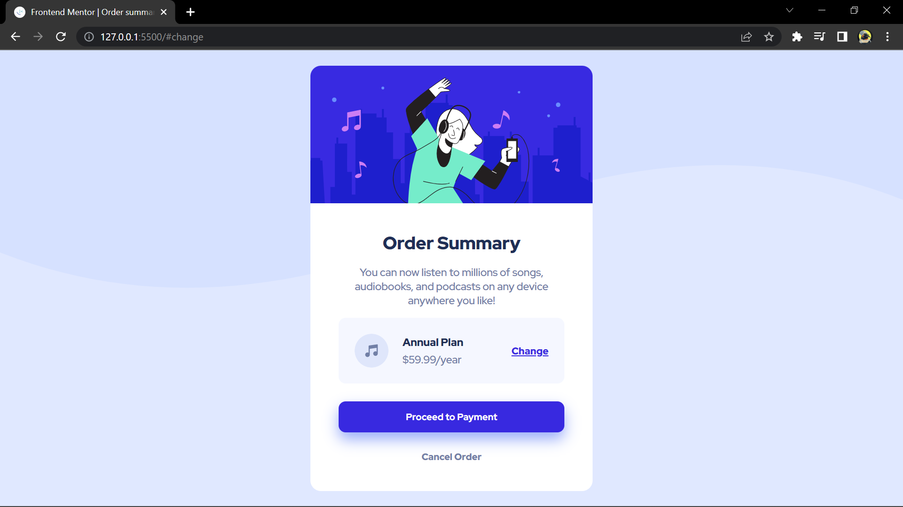

# Frontend Mentor - Order summary card solution

This is a solution to the [Order summary card challenge on Frontend Mentor](https://www.frontendmentor.io/challenges/order-summary-component-QlPmajDUj). Frontend Mentor challenges help you improve your coding skills by building realistic projects. 

## Table of contents

- [Overview](#overview)
  - [The challenge](#the-challenge)
  - [Screenshot](#screenshot)
  - [Links](#links)
  - [What I learned](#what-i-learned)
- [Author](#author)

## Overview

### The challenge

Users should be able to:

- See hover states for interactive elements

### Screenshot

### Links

- Solution URL: [Frontend Mentor](https://www.frontendmentor.io/solutions/order-summary-component-FM3Fp2pHEA)
- Live Site URL: [Live site](https://69kwan69.github.io/order-summary-component/)

### What I learned

CSS background shorhand's quite tricky.

## Author

- Frontend Mentor - [@69kwan69](https://www.frontendmentor.io/profile/69kwan69)
